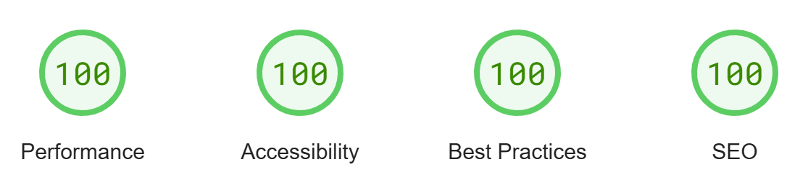

# Blog Site

This is a [Next.js](https://nextjs.org/), [Tailwind CSS](https://tailwindcss.com/) blogging starter template.

**Use it to build your own blog.** Simply fork and follow the instructions below.

Currently acting as my personal blog.

## Demo

- https://www.franciscomoretti.com/

## Axioms

1. **Next.js First**: use framework (Next.js) features when possible and avoid reinventing the wheel.
2. **Few deeply integrated services**: Uses a simple set of services with free tiers that are well integrated into the platform.

## Features

- ✅ Next.js `/app` dir
- ✅ Blog-like layouts
- ✅ SEO friendly with RSS feed, sitemaps and metadata.
- ✅ Projects page
- ✅ TOC (Table of contents)
- ✅ Static Site Generation (SSG)
- ✅ UI Components built using **Shadcn/ui**
- ✅ **blog** pages using **MDX** and **Contentlayer**
- ✅ Styled using **Tailwind CSS**
- ✅ Written in **TypeScript**
- ✅ Copy code button
- ✅ Search with **cmd+k**
- ✅ Mobile-friendly
- ✅ Customizable tailwind theme
- ✅ View count for each post using **Prisma** and **Turso**
- ✅ Font optimization with [next/font](https://nextjs.org/docs/app/api-reference/components/font)
- ✅ Light and dark theme
- ✅ **Posthog** for analytics
- ✅ Math display supported via [KaTeX](https://katex.org/)
- ✅ Github alerts via [remark-github-blockquote-alert](https://github.com/jaywcjlove/remark-github-blockquote-alert)
- ✅ Automatic image optimization via [next/image](https://nextjs.org/docs/basic-features/image-optimization)
- ✅ Server side code syntax highlight with **Rehype Pretty Code**
- ✅ Preconfigured security headers

- ✅ Perfect Lighthouse Scores (Mobile and Desktop)



## Inspiration

- [Tailwind Nextjs Starter Blog](https://github.com/timlrx/tailwind-nextjs-starter-blog)
- [Shadcn/ui](https://github.com/shadcn-ui/ui)

## Quick Start Guide

1. Clone the repo

```bash
npx degit 'FranciscoMoretti/site'
```

2. Personalize `siteMetadata.js` (site related information)
<!-- 3. Modify the content security policy in `next.config.js` if you want to use
   other analytics provider or a commenting solution other than **giscus**. -->
3. Personalize `authors/default.md` (main author)
4. Modify `projectsData.ts`
5. Modify `headerNavLinks.ts` to customize navigation links
6. Add blog posts
7. Create the `.env` file `cp .env.example .env` and set the environment variables
8. Deploy on Vercel

## Installation

```bash
npm install
```

## Development

First, run the development server:

```bash
bun dev
```

## Extend / Customize

`data/siteMetadata.js` - contains most of the site related information which should be modified for a user's need.

`data/authors/default.md` - default author information (required). Additional authors can be added as files in `data/authors`.

`data/projectsData.js` - data used to generate styled card on the projects page.

`data/headerNavLinks.js` - navigation links.

`data/logo.svg` and `public/static/logo.png` - replace with your own logo.

`data/blog` - replace with your own blog posts.

`public/static` - store assets such as images.

`app/manifest.webmanifest` - store assets such as images ([Next.js Docs](https://nextjs.org/docs/app/api-reference/file-conventions/metadata/manifest))

`app/favicon.ico`, `app/icon.svg`, and `app/apple-icon.png`, `app/android-chrome-192x192.png`, `app/android-chrome-512x512.png` - replace with your own favicon, and icon files ([Next.js Docs](https://nextjs.org/docs/app/api-reference/file-conventions/metadata/app-icons)). Icons can be generated using [RealFaviconGenerator](https://realfavicongenerator.net/)

`tailwind.config.js` and `css/tailwind.css` - tailwind configuration and stylesheet which can be modified to change the overall look and feel of the site.

`css/rehype-code.css` - controls the styles associated with the code blocks. Feel free to customize it and use your preferred prismjs theme e.g. [Rehype Pretty Code](https://rehype-pretty.pages.dev/).

`contentlayer.config.ts` - configuration for Contentlayer, including definition of content sources and MDX plugins used. See [Contentlayer documentation](https://www.contentlayer.dev/docs/getting-started) for more information.

`components/MDXComponents.js` - pass your own JSX code or React component by specifying it over here. You can then use them directly in the `.mdx` or `.md` file. By default, a custom link, `next/image` component, table of contents component and Newsletter form are passed down. Note that the components should be default exported to avoid [existing issues with Next.js](https://github.com/vercel/next.js/issues/51593).

`layouts` - main templates used in pages:

- There are currently 3 post layouts available: `PostLayout`, `PostSimple` and `PostBanner`. `PostLayout` is the default 2 column layout with meta and author information. `PostSimple` is a simplified version of `PostLayout`, while `PostBanner` features a banner image.
- There are 2 blog listing layouts: `ListLayout`, the layout used in version 1 of the template with a search bar and `ListLayoutWithTags`, currently used in version 2, which omits the search bar but includes a sidebar with information on the tags.

`next.config.js` - configuration related to Next.js. You need to adapt the Content Security Policy if you want to load scripts, images etc. from other domains. 3. Replace the `opengraph-image.jpg` for your own image and `opengraph-image.alt.txt` for its alt text. [Opengraph Image](https://nextjs.org/docs/app/api-reference/file-conventions/metadata/opengraph-image)

## Setting up the database (Turso DB)

Check out the [setup guide](https://docs.turso.tech/sdk/ts/orm/prisma). Get the API key and set it in the `.env` file.

Push the prisma DB

```sh
npm run db:push
```

## Analytics

Analytics are provided automatically by Vercel and their free tier is a great way to start. As an alternative, Posthog is integrated as well.

### Posthog

To use Posthog you need to create an account and set the keys in the `.env` file

```
NEXT_PUBLIC_POSTHOG_KEY=<ph_project_api_key>
NEXT_PUBLIC_POSTHOG_HOST=<ph_instance_address>
```

## Post model

Content is modelled using [Contentlayer](https://www.contentlayer.dev/), which allows you to define your own content schema and use it to generate typed content objects. See [Contentlayer documentation](https://www.contentlayer.dev/docs/getting-started) for more information.

## Frequently Asked Questions

- [How can I add a custom MDX component?](/faq/custom-mdx-component.md)
- [How can I customize the `kbar` search?](/faq/customize-kbar-search.md)
- [Deploy with docker](/faq/deploy-with-docker.md)

Facing issues? Check the [FAQ page](https://github.com/FranciscoMoretti/site/wiki) and do a search on past issues. Feel free to open a new issue if none has been posted previously.

Feature request? Check the past discussions to see if it has been brought up previously. Otherwise, feel free to start a new discussion thread. All ideas are welcomed!

## Licence

[MIT](https://github.com/FranciscoMoretti/site/blob/main/LICENSE) © [Francisco Moretti](https://www.franciscomoretti.com)
